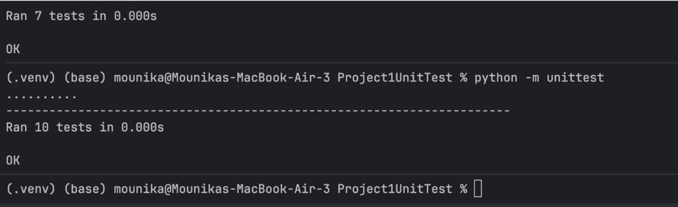

# Software Quality Assurance : Final Presentation
**Student:** Mounika Garikipati
**Worked:** Individually
**Date:** May 2026

---

## Slide 1: Target Testing Applications

### What I Built & Tested

Across this course I built and tested **two core applications** that evolved week over week:

#### Application 1 : Triangle Classifier (Projects 1 & 2)
A Python program that takes three side lengths and determines whether they form a valid triangle, and if so what type (Equilateral, Isosceles, or Scalene). This was extended into a full **Flask REST API** for Project 2.

- Built with: **Python + Flask**
- Tested with: **PyUnit (unittest)** and **Postman**
- Hosted: locally on `http://127.0.0.1:5000`

#### Application 2 : QA Arcade (Projects 3 & 4 + All Vibe Coding)
A gamified React web app that teaches software testing methodology through One Piece-themed boss battles. Players act as QA testers finding intentional bugs planted in password checkers, restaurant billing systems, and combat engines.

- Built with: **React 18 + Vite**, deployed to **GitHub Pages**
- Tested with: **JMeter** (performance) and **Selenium** (browser automation)
- Live URL: `https://mounikagarikipati.github.io/Software-Quality-Test/`

### How I Built It

The Triangle app was coded manually in Python following the classic example from *The Art of Software Testing*. The QA Arcade was **vibe coded** — I described what I wanted in natural language and used AI tools to generate the React components, game logic, and intentional bugs.

### AI Tools Used

| Tool | How I Used It |
|------|--------------|
| **Claude / Claude Code** | Primary coding assistant — wrote React components, Selenium tests, debugged errors iteratively |
| **Replit Agent** | Scaffolded the initial QA Arcade React app structure and CSS |
| **Antigravity** | Assisted with specific component generation and layout |

### Screenshot : QA Arcade Main Menu
> 📸 *[Insert screenshot of QA Arcade main menu showing all 3 boss battle cards]*

### Screenshot : Triangle API in Postman
> 📸 *[Insert screenshot of POST /triangles returning Scalene result]*

---

## Slide 2: Summary of Results from 4 Assignments

---

### Project 1: Unit Testing - Triangle Classifier

**Goal:** Write comprehensive unit tests for a triangle classification function using Python's `unittest` framework.

**What was tested:**

| Test Category | Examples | Result |
|--------------|---------|--------|
| Valid Equilateral | (5,5,5), (1.5,1.5,1.5), (1000,1000,1000) | ✅ Pass |
| Valid Isosceles | (5,5,3), (12,12,13) | ✅ Pass |
| Valid Scalene | (3,4,5), (7,10,5) | ✅ Pass |
| Zero values | (0,4,5) | ✅ Pass |
| Negative values | (-1,4,5) | ✅ Pass |
| Triangle inequality failures | (1,2,3), (2,3,5) | ✅ Pass |
| Floating point | (2.5,3.5,4.5) | ✅ Pass |
| Large numbers | (1000,999,998) | ✅ Pass |
| Edge case | (1,1,1.9999) → Isosceles | ✅ Pass |

**Final Result:** `Ran 10 tests — OK` — All tests passed

**Key Lesson:** Boundary values and order variations are easy to miss without systematic testing. Input (5,3,4) must produce the same result as (3,4,5).

### Screenshot — Unit Test Output

---

### Project 2: Integration Testing — Triangle API with Postman

**Goal:** Build a Flask REST API wrapping the triangle logic and test all endpoints using Postman.

**API Endpoints Tested:**

| Method | Endpoint | Test Case | Expected | Result |
|--------|---------|-----------|----------|--------|
| GET | /triangles | Empty list on startup | `[]` | ✅ Pass |
| POST | /triangles | (3,4,5) | `Scalene` | ✅ Pass |
| POST | /triangles | (5,5,5) | `Equilateral` | ✅ Pass |
| POST | /triangles | (0,4,5) | `Invalid` | ✅ Pass |
| POST | /triangles | (-1,4,5) | `Invalid` | ✅ Pass |
| POST | /triangles | (2.5,3.5,4.5) | `Scalene` | ✅ Pass |
| POST | /triangles | (1000,999,998) | `Scalene` | ✅ Pass |
| GET | /triangles/1 | Retrieve by ID | Triangle object | ✅ Pass |
| GET | /triangles/2 | Non-existent ID | 404 error | ✅ Pass |
| DELETE | /triangles/1 | Delete by ID | `Deleted` | ✅ Pass |

**Extra Credit:** All tests also verified using `curl` from terminal.

**Key Lesson:** Integration testing catches issues that unit tests miss — for example, verifying that HTTP status codes (404 vs 200) are returned correctly, not just that the logic works in isolation.

### Project 3: Performance Testing — JMeter on QA Arcade

**Goal:** Simulate realistic and extreme traffic against the deployed GitHub Pages QA Arcade app using Apache JMeter.

**Test 1 : Endurance Test (Soak Test)**

Sustained moderate load over time to detect memory leaks or server degradation.

| Metric | Result |
|--------|--------|
| Total Requests | 12,726 |
| Average Response Time | **104 ms** |
| Error Rate | **0.08%** |
| Verdict | ✅ Excellent stability |

**Test 2 : Spike Test**

500 simultaneous users within a 1-second ramp-up — simulating a viral moment.

| Metric | Result |
|--------|--------|
| Threads (Users) | 500 |
| Ramp-up Period | 1 second |
| Average Response Time | **292 ms** (nearly 3× normal) |
| Max Response Time | 973 ms |
| Error Rate | **0.00%** |
| Verdict | ✅ GitHub Pages absorbed the spike with zero crashes |

**Key Lesson:** GitHub Pages is remarkably resilient for a static host. The spike tripled response time but never produced errors — a great result for a frontend-only app. For a backend API with database calls, these numbers would look very different.

### Screenshot : Endurance Test Summary Report

### Screenshot : Spike Test Summary Report

---

### Project 4: Browser Automation : Selenium on QA Arcade

**Goal:** Write automated Selenium tests in Python to interact with the deployed QA Arcade app and verify that the game mechanics work correctly.

**3 Test Classes, 21 Total Tests:**

#### Test 1 : Main Menu Navigation (6 tests)
Verified the menu loads with all 3 boss battle cards, all 3 play buttons are enabled, and navigation into a level and back works correctly.

| Test | Result |
|------|--------|
| QA Arcade heading in page source | ✅ Pass |
| Arlong Park card visible | ✅ Pass |
| Crocodile's Desert card visible | ✅ Pass |
| Doflamingo's Strings card visible | ✅ Pass |
| All 3 play buttons enabled | ✅ Pass |
| Navigate into Arlong and back | ✅ Pass |

#### Test 2 : Arlong Park: State Transition Bug (7 tests)
Selected FROM=Calm, TO=Defeated and verified the bug banner appeared confirming the spec says INVALID but the system says VALID.

| Test | Result |
|------|--------|
| Arlong level loads | ✅ Pass |
| FROM = Calm selected | ✅ Pass |
| TO = Defeated selected | ✅ Pass |
| Test Transition clicked | ✅ Pass |
| Bug banner appears | ✅ Pass |
| Expected=INVALID, Actual=VALID | ✅ Pass |
| Bug counter shows 1/3 | ✅ Pass |

#### Test 3 : Doflamingo: Data Flow Pipeline Bug (8 tests)
Selected Injured/Awakened=Yes/Distance=1m and verified Expected=97, Actual=108, exposing 3 simultaneous data flow bugs.

| Test | Result |
|------|--------|
| Doflamingo level loads | ✅ Pass |
| Emotion = Injured | ✅ Pass |
| Awakened = Yes | ✅ Pass |
| Distance = 1m | ✅ Pass |
| Pipeline spec panel expands | ✅ Pass |
| Bug banner appears | ✅ Pass |
| Expected=97, Actual=108 | ✅ Pass |
| Bug counter shows 1/3 | ✅ Pass |

**Final Result:** `Ran 21 tests in 34.5s — OK` — All tests passed ✅

**Notable debugging challenges:**
- React's CSS `text-transform: uppercase` made button text `"FIGHT ARLONG →"` not match `"Arlong"` — fixed with `.upper()` comparison
- Third card (Doflamingo) rendered off-screen, causing empty text — fixed with `--force-device-scale-factor=0.67` and scroll-into-view
- GitHub Pages + React hydration timing required custom `WebDriverWait` polling for non-empty text content, not just element visibility

### Screenshot : All 21 Tests Passing

## Slide 3: Short Demo

### Live Demo : Selenium Test Suite

**What I'll show:**
1. Run `python qa_arcade_selenium_tests.py` from terminal
2. Watch Chrome open automatically and navigate to QA Arcade
3. See Selenium click FROM=Calm, TO=Defeated in Arlong Park
4. Watch the bug banner appear: *"🚨 BUG! Expected INVALID but system says VALID!"*
5. Watch Chrome switch to Doflamingo, select Injured/Yes/1m, submit, and verify Expected=97 vs Actual=108
6. Show terminal output: all 21 tests green

**Why this demo:** It shows the full testing lifecycle — a spec is defined, a bug is intentionally planted, and automated testing catches it without human intervention.

---

## Slide 4: Analysis of Agentic AI Coding Tools

### What Are Agentic AI Tools?

Agentic AI tools go beyond answering questions — they **take actions**: write files, run commands, browse the web, iterate on errors, and build entire applications from natural language descriptions. Tools used in this class include Claude Code, Replit Agent, and Antigravity.

---

### Pros of Agentic AI Tools for Testing

**1. Speed of Scaffolding**
The entire QA Arcade React application — components, CSS, game logic, routing — was scaffolded in hours rather than weeks. Without AI, building a multi-level interactive game from scratch would have taken the majority of the semester.

*Real example:* The Arlong Park state machine component (`ArlongGame.jsx`) with toggle buttons, feedback cards, attempt tracking, and animation was generated in a single prompt.

**2. Pattern Completion Across Files**
Once the structure of one game level was established, AI could replicate the pattern for subsequent levels (Crocodile, Doflamingo) with high fidelity — same component architecture, same CSS class conventions, same state shape.

*Real example:* After Week 3's Password Bug Hunt was built, Weeks 5 and 7 followed the same structural template with minimal additional guidance.

**3. Test Code Generation**
AI generated the initial Selenium test suite — 21 test methods across 3 classes — including WebDriverWait patterns, custom polling conditions, and JavaScript scrollIntoView calls that would be tedious to write manually.

**4. Iterative Debugging**
When tests failed, pasting error messages back to Claude produced targeted fixes. Each iteration narrowed the problem — from `StopIteration` to case mismatch to React hydration timing — without starting over.

---

### Cons of Agentic AI Tools for Testing

**1. AI Defaults to Correctness — Bugs Must Be Explicitly Designed**
The hardest challenge in building QA Arcade was getting AI to write *intentionally wrong* code. Every time I asked for a buggy implementation, the AI defaulted to correct logic. Bugs had to be specified precisely:
> *"Change the multiplier from 0.5 to 0.75 and swap steps 2 and 3 in the pipeline"*

*Testing implication:* AI cannot independently design meaningful test cases for defect injection — a human must define what a "realistic bug" looks like.

**2. Hallucination Risk in Logic**
When generating the buggy bill logic for the restaurant level (Week 5), AI produced bugs that were internally inconsistent — the same combination returned different values in expected vs actual for reasons that didn't map to any real pricing rule. Every generated logic block required manual verification against the specification.

**3. Timing and Environment Blind Spots**
The Selenium tests went through 5 major revision cycles because AI consistently underestimated React hydration timing on GitHub Pages. The AI knew Selenium patterns in theory but didn't anticipate that:
- CSS `text-transform` changes what `.text` returns
- Elements can exist in the DOM with empty text before React renders
- A flex-wrapped third card off-screen never gets its text populated

These are environment-specific constraints invisible to AI training data.

**4. Prompt Specificity Required for Quality**
Vague instructions produced structurally correct but pedagogically wrong results. "Make it more complicated" added inputs and bugs randomly rather than ones that actually teach a testing concept. The educator/tester must provide domain knowledge explicitly.

---

### Special Considerations for Testing with AI Tools

**1. You Cannot Trust AI-Generated Test Cases Blindly**
AI will write tests that pass against AI-generated code — but both can share the same misunderstanding of the specification. Always verify test cases against the *actual requirement*, not just against the implementation.

*Example from this class:* If I had asked AI to write both the Doflamingo implementation AND the tests, it would have written tests that pass against the buggy multiplier (0.75) because it wouldn't know 0.5 was the spec.

**2. AI-Generated Tests May Test the Wrong Thing**
AI tends to test what's easy to observe (element exists, text contains X) rather than what's meaningful (the business logic is correct). The most valuable tests in Project 4 were the ones that verified specific numeric outputs (97 vs 108) — those required human design.

**3. Regression Testing Still Requires Human Judgment**
When fixing the Selenium tests across 5 versions, each fix sometimes broke a different assumption. AI fixes are locally optimal — they solve the reported error without always considering downstream effects. A human must track the full test contract.

**4. AI Accelerates Everything — Including Bad Practices**
AI can generate 100 test cases in seconds, but quantity is not quality. Without deliberate design using BVA, equivalence partitioning, or decision tables, AI-generated tests cluster around happy paths and miss the boundaries and combinations that real bugs hide in.

---

### Summary Table

| Dimension | AI Strength | AI Limitation |
|-----------|------------|---------------|
| Scaffolding | Excellent — hours not weeks | Needs human architecture decisions |
| Bug design | Needs explicit specification | Defaults to correctness |
| Test generation | Fast boilerplate | Misses domain-specific edge cases |
| Debugging | Good with error messages | Environment blind spots |
| Pedagogy | Can't design learning outcomes | Human must define what teaches |
| Logic verification | Risky without spec review | May validate wrong implementation |

---

### Final Takeaway

Agentic AI tools are powerful **accelerators** but not **replacements** for testing expertise. They are best used by someone who already understands what good testing looks like — who can direct the AI toward meaningful test cases, catch hallucinations in generated logic, and verify that what passes in tests actually reflects what the specification requires.

The most important skill this course teaches is not how to use a tool — it's how to think about what needs to be tested, and why. That judgment cannot be delegated to AI.

---

*Presented by Mounika Garikipati — Software Quality Assurance, Week 8*
