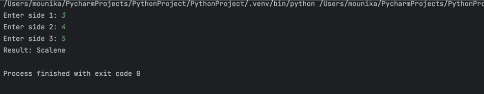

# Project 1 - Triangle Unit Testing

## Description
This program determines whether three given sides can form a valid triangle and identifies its type if valid. It is based on the triangle example in The Art of Software Testing and was implemented in Python.

The program is designed to handle typical user input errors, such as zero or negative values, non-numeric input, and impossible triangles that fail the triangle inequality rule. Triangle types identified by the program include:

**Equilateral Triangle** – all three sides are equal   <br>
**Isosceles Triangle** – exactly two sides are equal   <br>
**Scalene Triangle** – all sides are different   <br>

Invalid input cases are also detected and handled with appropriate messages.
## Features
- **Triangle Validation** – Checks if the given sides can form a triangle
- **Triangle Type Identification** – Determines whether a triangle is scalene, isosceles, or equilateral
- **Error Handling** – Detects invalid inputs, including:  <br>
  - Zero or negative sides 
  - Non-numeric inputs 
  - Triangle inequality failures
- **Unit Testing** – Comprehensive unit tests cover all valid and invalid scenarios to ensure program correctness
- **Edge Case Handling** – Includes boundary tests for large numbers, floating-point values, and input order variations

## How to Run
python triangle.py   <BR>
The user is prompted to input three side lengths.<BR>
The program first verifies that all inputs are numeric.<BR>
It then checks that all sides are positive.<BR>
The triangle inequality rule is applied: the sum of any two sides must be greater than the remaining side.<BR>
If the triangle is valid, the program identifies its type and displays the result.<BR>
If the input is invalid, an appropriate error message is displayed.<BR>

## Example Test Data
| Side 1 | Side 2 | Side 3 | Expected Result                      |
| ------ | ------ | ------ | ------------------------------------ |
| 5      | 5      | 5      | Equilateral Triangle                 |
| 10     | 10     | 10     | Equilateral Triangle                 |
| 1.5    | 1.5    | 1.5    | Equilateral Triangle                 |
| 12     | 12     | 13     | Isosceles Triangle                   |
| 5      | 5      | 7      | Isosceles Triangle                   |
| 3      | 4      | 5      | Scalene Triangle                     |
| 7      | 10     | 5      | Scalene Triangle                     |
| 0      | 5      | 5      | Invalid Triangle (sides must be > 0) |
| -1     | 5      | 5      | Invalid Triangle (sides must be > 0) |
| 1      | 2      | 5      | Inputs fail triangle inequality test |
| "abc"  | 5      | 5      | Input must be numeric                |
| 2.5    | 3.5    | 4.5    | Scalene Triangle                     |
| 1000   | 1000   | 1000   | Equilateral Triangle                 |

Note: This table includes representative examples from 20+ test cases implemented in the unit tests.
## How to Run Program
python -m unittest test_triangle.py <br>
Open a terminal in the project directory.<br>
Run the program using Python:<br>
python triangle.py<br>
The program will prompt you to enter three side lengths.<br>
After entering the values, the program will display either the triangle type or an error message.<br>

## How to Run Unit Tests
Unit tests are written using Python’s unittest module to automatically verify the program against a wide range of scenarios, including:<br>

Valid triangles (Equilateral, Isosceles, Scalene)<br>
Invalid triangles (zero, negative, non-numeric input)<br>
Triangle inequality failures<br>
Edge cases (large numbers, floating-point values, order variations)<br>

To run the tests, use:<br>
```Bash
python -m unittest
```
Or, to run a specific test file:
```bash
python -m unittest test_triangle
```
All tests should pass, and any failures will indicate a scenario that needs to be fixed.<br>

## Bugs and Fixes
During testing, several issues were identified and resolved:<br>

Non-numeric input – Added checks to ensure all inputs are numbers.<br>
Zero or negative sides – Program now rejects zero or negative values.<br>
Triangle inequality failures – Program identifies impossible triangles that violate the sum-of-sides rule.<br>

## Problems Encountered
Initial test runs failed due to incorrect imports; this was fixed by ensuring the triangle.py function was correctly named and accessible from test_triangle.py.<br>
Handling edge cases such as floating-point values and very large numbers required careful validation.<br>

## Screenshots / Output
Example Run:

Enter side 1: 3
Enter side 2: 4
Enter side 3: 5
Result: Scalene Triangle

Enter side 1: -3
Enter side 2: -4
Enter side 3: -5
Result: Invalid triangle


Unit Test Output:

....................
----------------------------------------------------------------------
Ran 10 tests

OK

