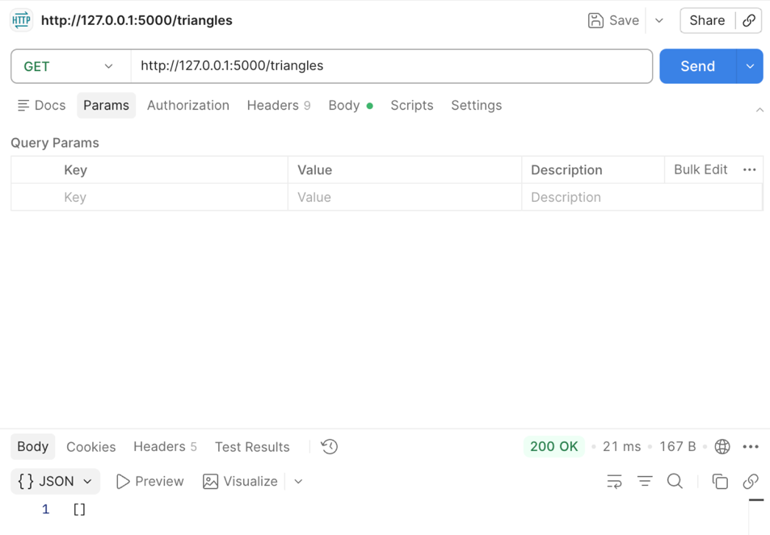
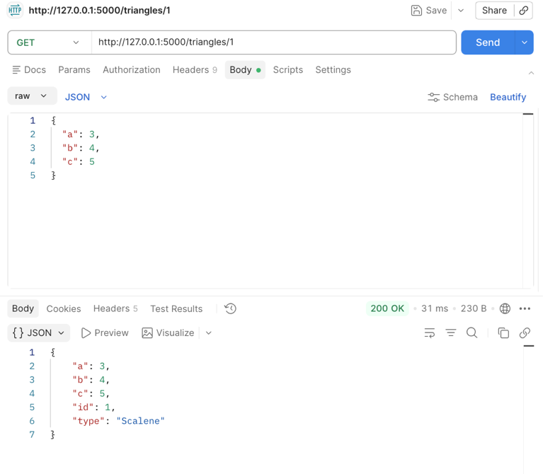
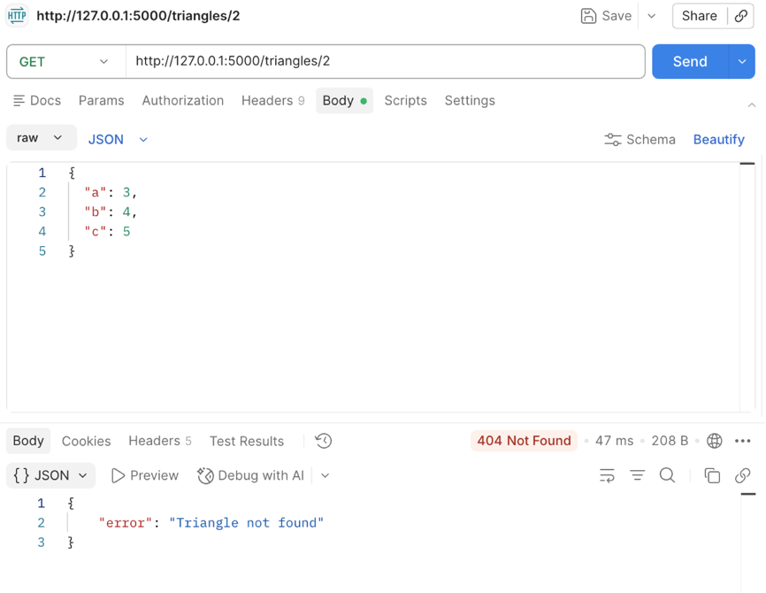
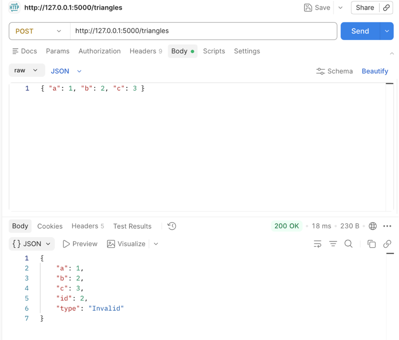
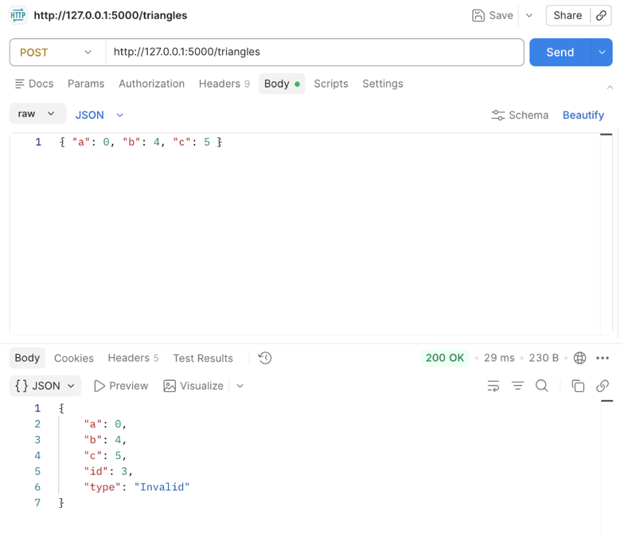
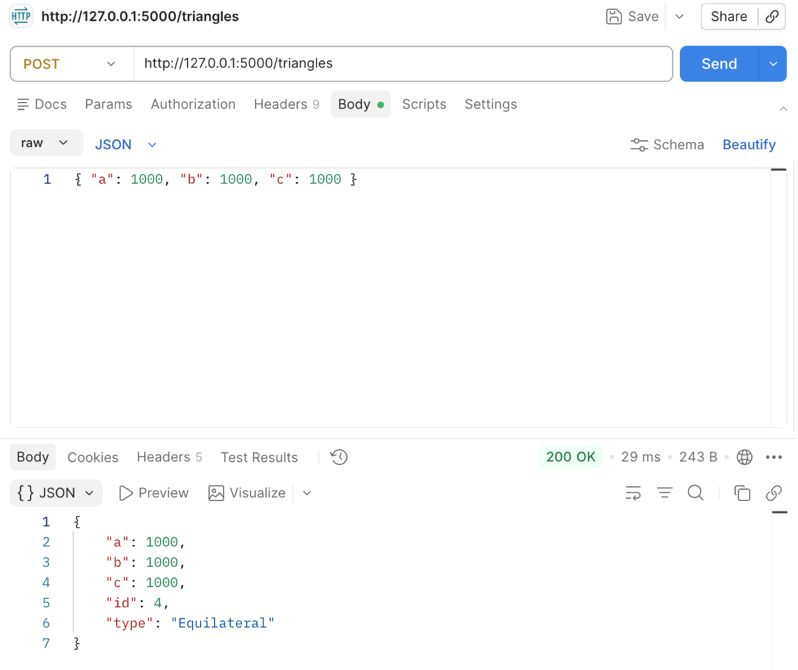
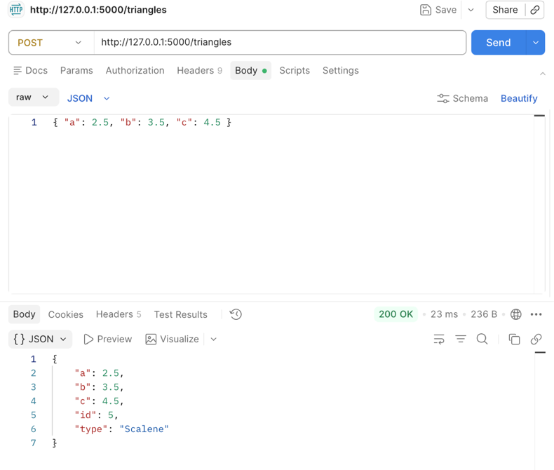
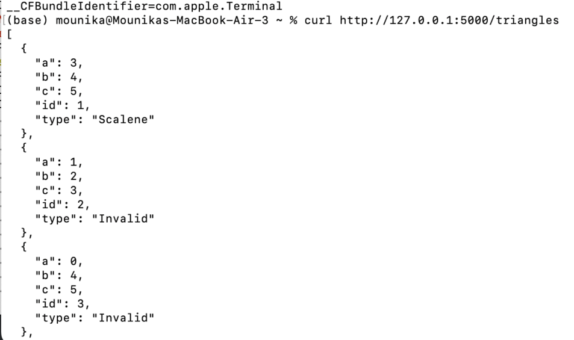
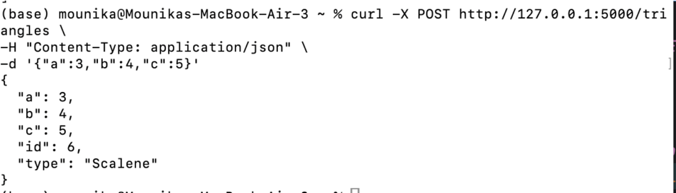

# Project 2 – Integration Testing with Postman

## Introduction

This project focuses on understanding integration testing using APIs and Postman. The goal of this assignment is to explore how different components of a system communicate with each other through HTTP requests and responses. In this project, a Triangle API was developed using Python and Flask to simulate a real-world backend service. Postman was used to send requests to the API and validate the responses.

The project also demonstrates how different HTTP methods such as GET, POST, and DELETE are used to interact with API endpoints. Error handling and edge cases were tested to ensure the robustness of the system. Additionally, curl commands were used to perform API testing from the terminal as part of extra credit.


## Part 1: Research on APIs and Integration Testing

### HTTP Functionality

HTTP (HyperText Transfer Protocol) is the foundation of communication between clients and servers on the web.

* **Client:** A client is a system that sends requests to a server. Examples include web browsers and Postman.
* **Server:** A server receives requests and sends responses back to the client.
* **Request:** A request is sent by the client and includes a method (GET, POST, etc.), headers, and sometimes a body.
* **Response:** A response is sent by the server and contains status codes, headers, and data.
* **Headers vs Body:** Headers contain metadata (such as content type), while the body contains actual data.
* **Status Codes:** Examples include 200 (success), 404 (not found), and 500 (server error).
* **HTTP Verbs:**

  * GET: Retrieve data
  * POST: Create data
  * PUT: Update data
  * DELETE: Remove data

### Stateless Nature of HTTP

HTTP is a **stateless application-layer protocol**, meaning that each request from a client to a server is treated as an independent transaction. The server does not retain any information about previous requests once a response has been sent. As a result, every HTTP request must include all the necessary data required for the server to process it.

This design improves scalability and simplicity because the server does not need to maintain session state between requests. However, in real-world applications, mechanisms such as **cookies, session IDs, and tokens (e.g., JWT)** are used to simulate stateful interactions when needed, such as user authentication or session tracking.


## Role of APIs in Modern Applications

Application Programming Interfaces (APIs) serve as **intermediaries that enable communication between different software systems**. In modern architectures, especially **microservices and distributed systems**, APIs are essential for enabling modular and scalable design.

APIs allow applications to expose specific functionalities or data without revealing internal implementation details. For example, a frontend web application communicates with a backend server via REST APIs to retrieve or update data. APIs are widely used in web applications, mobile apps, cloud services, and third-party integrations.


## Open APIs (Public APIs)

Open APIs, also known as **public APIs**, are APIs that are made available to external developers with minimal restrictions. These APIs enable developers to integrate third-party services into their applications, accelerating development and innovation.

Open APIs typically follow standard protocols such as HTTP and use data formats like JSON or XML. They are commonly documented using tools like **OpenAPI Specification (Swagger)**, which provides clear definitions of available endpoints, parameters, and responses.


## Example of Open API Usage

In my practicum project, I utilized the Grok API as part of an AI-based skill tracker application. The API was used to process user input and generate intelligent suggestions related to skill development. This demonstrates how modern applications integrate external AI services through APIs to enhance functionality.

The Grok API was accessed using an API key, which is required to authenticate requests. Each request included the API key in the header to ensure secure communication between the client application and the API server. The request was sent using HTTP methods (primarily POST), and the response was returned in JSON format containing AI-generated suggestions.

This integration highlights several important aspects of API usage:

Secure access using API keys
Sending structured requests with input data
Receiving dynamic, intelligent responses
Leveraging third-party services instead of building complex AI models from scratch

By using the Grok API, the application was able to provide personalized recommendations without implementing its own machine learning infrastructure. This approach improves development efficiency and demonstrates the practical value of Open APIs in building scalable and feature-rich applications.
## Cross-Origin Resource Sharing (CORS)

Cross-Origin Resource Sharing (CORS) is a **browser-based security mechanism** that controls how resources on a web server can be requested from a different domain (origin). An origin is defined by the combination of protocol, domain, and port.

By default, browsers enforce the **Same-Origin Policy**, which restricts cross-origin HTTP requests. CORS allows servers to explicitly specify which origins are permitted to access resources by including specific HTTP headers such as:

* `Access-Control-Allow-Origin`
* `Access-Control-Allow-Methods`
* `Access-Control-Allow-Headers`

CORS is essential in modern web applications where frontend and backend services are hosted on different domains.


## API Security

API security is critical to protect data and prevent unauthorized access. Common security mechanisms include:

* **API Keys:** Unique identifiers used to authenticate requests from a client application.
* **Authentication Tokens (JWT):** JSON Web Tokens are used for stateless authentication and securely transmit user identity information.
* **HTTPS Encryption:** Ensures that data transmitted between client and server is encrypted using TLS (Transport Layer Security).
* **OAuth 2.0:** A widely used authorization framework that allows third-party applications to access user data without exposing credentials.

To access a secure API, clients must provide valid credentials, such as API keys or tokens, typically included in HTTP headers.
In the skill tracker project in my practicum, API security was implemented using an API key provided by the Grok service. The key was included in the request headers to authenticate each API call. This ensures that only authorized users or applications can access the API.

For example, a typical request includes:

Authorization header containing the API key
HTTPS protocol to encrypt data in transit
Structured JSON payload for input data

This approach prevents unauthorized access and protects sensitive information. Additionally, using HTTPS ensures that the communication between the client and server is encrypted, reducing the risk of interception or data breaches.

This real-world implementation reinforces the importance of securing APIs using authentication mechanisms and encryption protocols.


## Public Open APIs

Some widely used public APIs include:

* **JSONPlaceholder:** A fake REST API for testing and prototyping.
* **OpenWeather API:** Provides real-time weather data and forecasts.
* **REST Countries API:** Supplies information about countries such as population, region, and languages.
* **NASA API:** Offers access to space-related data such as images and planetary information.
* **GitHub API:** Enables interaction with GitHub repositories, users, and issues programmatically.

These APIs are commonly used for learning, testing, and building real-world applications.


## Part 2: Postman Testing

### API Development

A Triangle API was developed using Python and Flask. The API accepts three side lengths and determines whether the triangle is valid and its type (Scalene, Isosceles, or Equilateral).

### Endpoints Used

| Method | Endpoint        | Description                  |
| ------ | --------------- | ---------------------------- |
| GET    | /triangles      | Retrieve all triangles       |
| POST   | /triangles      | Create a new triangle        |
| GET    | /triangles/{id} | Retrieve a specific triangle |
| DELETE | /triangles/{id} | Delete a triangle            |


### Postman Setup

A collection named **"Triangle API Testing"** was created in Postman. An environment variable was defined:

* url = http://127.0.0.1:5000

All requests used `{{url}}` as the base URL.


### Example Requests and Responses

#### 1. GET Request (All Triangles)

**Request:**

```
GET {{url}}/triangles
```

**Response:**

```
[]
```


#### 2. POST Request (Create Triangle)

**Request Body:**

```json
{
  "a": 3,
  "b": 4,
  "c": 5
}
```

**Response:**

```json
{
  "id": 1,
  "a": 3,
  "b": 4,
  "c": 5,
  "type": "Scalene"
}
```


#### 3. GET Request by ID

```
GET {{url}}/triangles/1
```



#### 4. Error Case

```
GET {{url}}/triangles/2
```

**Response:**

```json
{
  "error": "Triangle not found"
}
```



### Data Persistence

The API stores data temporarily in memory. Data is not persisted after the server stops. When the application restarts, all stored triangles are lost.


### Screenshots
here are the screenshots for all cases:
#### Invalid Triangle



#### Zero case

#### Large values


#### Decimal values


## Extra Credit: curl Testing

### GET Request using curl

```bash
curl http://127.0.0.1:5000/triangles
```


### POST Request using curl

```bash
curl -X POST http://127.0.0.1:5000/triangles \
-H "Content-Type: application/json" \
-d '{"a":3,"b":4,"c":5}'
```

### Advantages of curl

* Lightweight and fast
* Can be used in scripts and automation
* Does not require a graphical interface


## Conclusion

This project provided hands-on experience with integration testing using APIs and Postman. It demonstrated how HTTP methods are used to interact with backend systems and how responses are validated. The use of Postman made it easier to test multiple scenarios, including successful and error cases.

Developing the Triangle API helped in understanding backend logic, while testing it reinforced the importance of verifying system behavior. Overall, this project enhanced knowledge of API development, integration testing, and debugging techniques.


## References

Fielding, R. T. (2000). Architectural styles and the design of network-based software architectures.

Postman. (2023). Postman API Platform. https://www.postman.com/

Flask Documentation. https://flask.palletsprojects.com/
