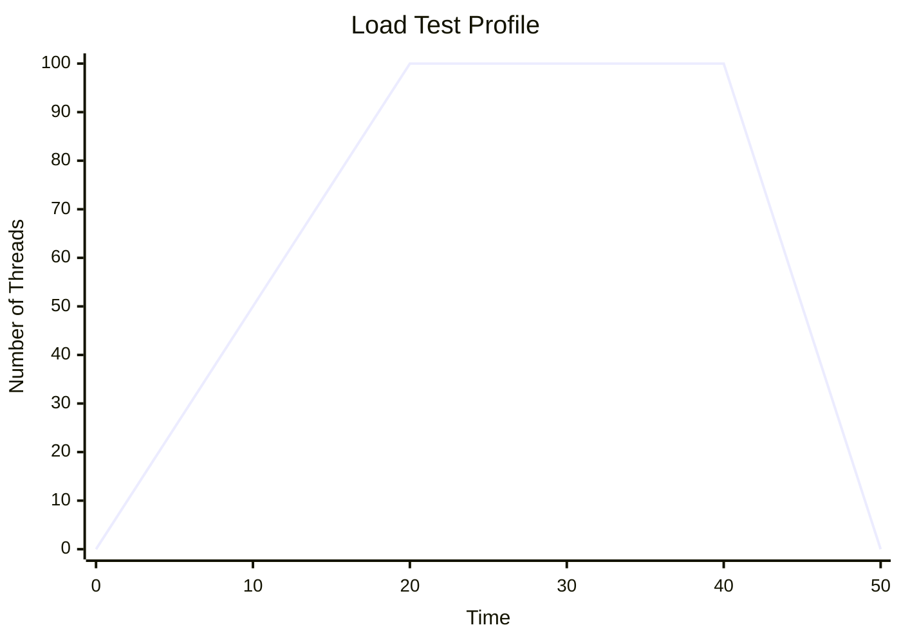
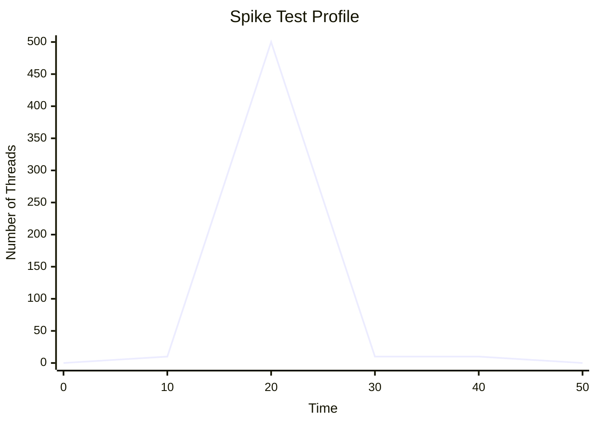

# Project 3: Performance Testing

## Introduction
This project explores the performance characteristics of our recently deployed React application ("Password Bug Hunt") hosted on GitHub Pages. Using Apache JMeter, we simulated different user traffic patterns to evaluate the reliability, speed, and endurance of the application under various loads. 

---

## Part 1: Research on Performance Testing and JMeter

### 1. Types of Performance Tests

**A. Load Testing**
Load testing checks how the system performs under its *expected* normal maximum traffic. The goal is to ensure the website runs smoothly when the usual number of users are browsing.


**B. Endurance Testing**
Endurance testing (or Soak Testing) evaluates how the system performs under a steady, moderate load over a long period of time. This catches issues like memory leaks or server degradation that only happen after hours of continuous use.
```mermaid
xychart-beta
    title "Endurance Test Profile"
    x-axis "Time (Hours)" [0, 1, 2, 3, 4, 5]
    y-axis "Number of Threads" 0 --> 50
    line [0, 20, 20, 20, 20, 20]
```

**C. Stress/Spike Testing**
A Spike test evaluates how the system handles a massive, sudden burst of simultaneous users. It tests whether the system will crash during a viral moment or quickly recover.


---

### 2. Components of JMeter
Below is an explanation of the core features used during the demo:

* **Thread Groups:** This is the starting point of any test plan. It defines the number of simulated users (Threads), the ramp-up time (how long it takes to start all users), and the loop count (how many times to repeat the test).
* **HTTP Request Sampler:** The sampler is what actually performs the work. It defines the exact Web Server (`mounikagarikipati.github.io`), the HTTP Method (`GET`), and the specific path of the application.
* **Config Elements (HTTP Header Manager):** Config elements manage variables and settings. The HTTP Header Manager was used to send a `User-Agent` string so the server treats the automated JMeter requests like real Google Chrome browsers.
* **Listeners:** Listeners capture and display the results of the samplers. The "View Results Tree" shows individual raw requests and their HTML responses, while the "Summary Report" aggregates the data to show average response times and error rates.

*(See Part 2 for screenshots of these components in action!)*

---

### 3. Application Performance Index (Apdex)
An **Application Performance Index (Apdex)** is an open international standard for measuring user satisfaction regarding an application's response time. It converts many measurements into one simple score ranging from `0` to `1` (0 = completely frustrating, 1 = perfectly fast and satisfying). Instead of just looking at raw average speed, Apdex categorizes user requests into three zones: *Satisfied*, *Tolerating*, and *Frustrated*.

---

## Part 2: JMeter Test Document (Demo)

### Test 1: Endurance Test
For the Endurance Test, we sustained a moderate payload against the deployed GitHub Pages application. 
* **Results:** As seen in the screenshots, the Endurance test successfully managed 12,726 requests. The server handled the steady traffic beautifully, yielding a very fast **Average Response Time of 104 ms**. The error rate was phenomenally low at `0.08%`, indicating exceptional endurance stability from GitHub Pages.

*(Please insert your Endurance Test Summary Report screenshot here)*

### Test 2: Spike Test
For the spike test, we hammered the exact same endpoint with 500 Threads (Users) within a 1-second ramp-up period.
* **Results:** The aggressive burst of 500 simultaneous users caused the server queuing to increase. The **Average Response Time nearly tripled to 292 ms** (and maxed out at 973 ms). Remarkably, GitHub Pages handled the massive burst with a `0.00%` error rate, serving every single spike request successfully without crashing or applying severe rate limits.

*(Please insert your Spike Test Summary Report, HTTP Request, and HTTP Header Manager screenshots here)*

---

## Extra Credit: Linux Performance Commands
If we were evaluating the backend server on a Virtual Machine instead of GitHub Pages, we could use the following Linux commands:
1. `top` / `htop`: Displays real-time interactive CPU, Memory, and running process utilization.
2. `vmstat`: Reports information about virtual memory, disk I/O, traps, and CPU activity.
3. `iostat`: Primarily monitors system input/output (I/O) device loading by observing the time physical disks are active.
4. `free -m`: Displays the total amount of free and used physical memory (RAM) and swap space in the system.

---

## Conclusion and Recommendations
**Summary:** Through this integration and performance testing assignment, I learned how to utilize Apache JMeter to construct realistic deployment scenarios. I was able to quantify the exact difference between steady website traffic (104ms response) and abrupt viral traffic (292ms delayed response). I successfully deployed a front-end application and utilized HTTP samplers and header managers to probe the API/routing infrastructure.

**Recommendations:** To improve this assignment, it could be beneficial to introduce an intentional bottleneck (like a slow API or an unoptimized backend database) so students can experience a system actually crushing under Stress/Spike testing, as GitHub Pages is notoriously difficult to crash for demonstration purposes.
