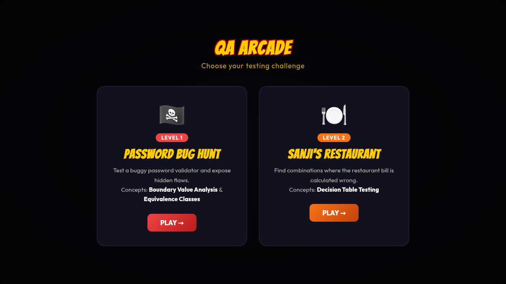
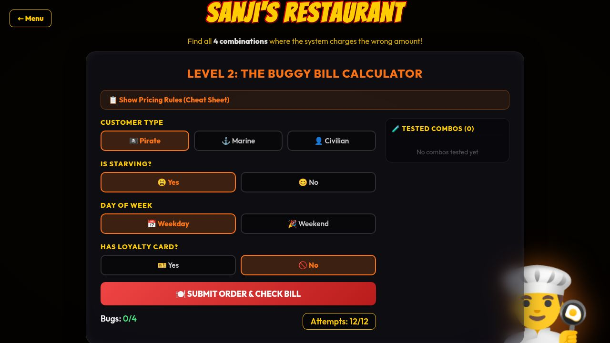

# QA Arcade — Vibe Coding Assignment Report

**Course:** Software Quality Assurance
**Assignment:** Vibe Coding — Week 5
**App:** [QA Arcade (Live Demo)](https://mounikagarikipati.github.io/Software-Quality-Test/vibe%20coding%20assignments/week%203/)


## Introduction

This project covers two foundational test-case design methodologies: **Boundary Value Analysis (BVA) with Equivalence Partitioning** and **Decision Table Testing**. Both are black-box testing techniques, meaning they require no knowledge of the internal source code — only the specification of how the system is supposed to behave.


### Decision Table Testing

**What it is:**
Decision Table Testing is used when system behavior depends on a combination of conditions. A decision table maps every meaningful combination of input conditions to its expected output (action). Each column in the table is a test case. This technique excels at exposing logic defects that only appear when specific combinations of inputs interact.

**When to use it:**
- When the specification has multiple independent conditions that together determine the outcome
- When the system has business rules involving if/and/or logic (e.g., pricing engines, loan approval systems, access control)
- When previous testing missed defects that only surface under specific input combinations

**Limitations:**
- The table grows exponentially: `n` binary conditions produce `2^n` combinations, making it impractical for systems with many inputs without reduction techniques like pairwise testing
- Requires a complete, accurate specification — ambiguous rules produce an incomplete table
- Reduced decision tables (collapsing "don't care" columns) require careful analysis to avoid hiding defects
- Does not by itself cover boundary values within the conditions


## Vibe Coding Assignment

### App Overview

**QA Arcade** is an interactive React application built with Vite that teaches software testing methodology through gameplay. The player acts as a QA tester and must find intentional bugs planted in two different systems. It uses a One Piece anime theme for visual engagement.

**Live App:** [mounikagarikipati.github.io/Software-Quality-Test/vibe coding assignments/week 3/](https://mounikagarikipati.github.io/Software-Quality-Test/vibe%20coding%20assignments/week%203/)

---

### Main Menu

The app launches with a hub screen where the player selects a level. Each card identifies the testing concept it teaches.



---


### Level 2 — Sanji's Restaurant (Decision Table Testing)

The player selects a combination of 4 input conditions and submits an order. The game shows the **Expected Bill** (correct rules) alongside the **Actual Bill** (buggy system). The player must find all 4 combinations where the amounts differ. With 24 total combinations (3 × 2 × 2 × 2) and only 12 attempts, systematic testing — like building a decision table — is required.



**Input Conditions:**

| Condition | Values |
|-----------|--------|
| Customer Type | Pirate, Marine, Civilian |
| Is Starving | Yes, No |
| Day of Week | Weekday, Weekend |
| Has Loyalty Card | Yes, No |

**Expected pricing rules (correct specification):**

| Customer | Starving | Day | Loyalty | Expected Bill |
|----------|----------|-----|---------|--------------|
| Pirate | Yes | Any | Any | **FREE** |
| Pirate | No | Any | Yes | **700 ฿** (30% off) |
| Pirate | No | Any | No | **1000 ฿** |
| Marine | Any | Weekend | Any | **2000 ฿** (2× price) |
| Marine | Any | Weekday | Yes | **900 ฿** (10% off) |
| Marine | Any | Weekday | No | **1000 ฿** |
| Civilian | Yes | Any | Any | **500 ฿** (50% off) |
| Civilian | No | Any | Yes | **800 ฿** (20% off) |
| Civilian | No | Weekend | No | **1200 ฿** (+20% surcharge) |
| Civilian | No | Weekday | No | **1000 ฿** |

**The 4 hidden bugs in the buggy system:**

```jsx
// BUG 1: Forgets 30% loyalty discount for Pirates
if (ct === 'Pirate' && starving === 'No' && loyalty === 'Yes') return 1000; // should be 700

// BUG 2: Forgets to double-charge Marines on weekends
if (ct === 'Marine' && day === 'Weekend') return 1000; // should be 2000

// BUG 3: Forgets 10% loyalty discount for Marines on weekdays
if (ct === 'Marine' && day === 'Weekday' && loyalty === 'Yes') return 1000; // should be 900

// BUG 4: Forgets weekend surcharge for Civilians with no loyalty card
if (ct === 'Civilian' && starving === 'No' && loyalty === 'No' && day === 'Weekend') return 1000; // should be 1200
```

#### Sunny Day Scenarios (system correct — bills match)

| Customer | Starving | Day | Loyalty | Expected | Actual | Match? |
|----------|----------|-----|---------|----------|--------|--------|
| Pirate | Yes | Weekday | No | FREE | FREE | ✔ No bug |
| Civilian | Yes | Weekend | Yes | 500 ฿ | 500 ฿ | ✔ No bug |
| Civilian | No | Weekday | No | 1000 ฿ | 1000 ฿ | ✔ No bug |

#### Rainy Day Scenarios (system wrong — bugs found)

| Customer | Starving | Day | Loyalty | Expected | Actual | Bug? |
|----------|----------|-----|---------|----------|--------|------|
| Pirate | No | Weekday | Yes | 700 ฿ | 1000 ฿ | 🚨 Bug 1 |
| Marine | Any | Weekend | Any | 2000 ฿ | 1000 ฿ | 🚨 Bug 2 |
| Marine | Any | Weekday | Yes | 900 ฿ | 1000 ฿ | 🚨 Bug 3 |
| Civilian | No | Weekend | No | 1200 ฿ | 1000 ฿ | 🚨 Bug 4 |

---

## Conclusion

### Problems Encountered

**1. Scope creep in the decision table complexity.**
Designing a decision table with enough depth to make the game challenging without becoming unmanageable was harder than expected. The initial version with 3 inputs and 2 bugs was too easy players could find both bugs in 4 tries by brute force. Adding a 4th input (Loyalty Card) expanded the combination space to 24 while making systematic test design genuinely necessary.

**2. Making bugs feel "plausible."**
The most difficult design challenge was ensuring each bug felt like a realistic developer mistake (forgetting a special case, using the wrong operator) rather than arbitrary randomness. The bugs had to be logically consistent with what a developer might actually write incorrectly under time pressure.

**3. React state-based navigation.**
Using React state as a "router" instead of a routing library (react-router-dom) was simpler to set up but requires all navigation state to be lifted into the top-level `App` component. As the app grows, this pattern would need to be replaced with proper routing to support deep linking and browser history.

**4. Screenshot limitations with SPA architecture.**
Because the app uses state-based navigation rather than URL-based routing, screenshots of inner screens cannot be captured by navigating to a URL. Workaround: temporarily hard-coding the default screen, taking the screenshot, then reverting.

---

### What I Learned About AI Tools

**Speed vs. accuracy.** AI coding tools (used via Replit Agent) are exceptionally fast at scaffolding boilerplate component structure, CSS, state management but require human judgment to define *what* the bugs should be and *why* they teach a testing concept. The AI writes the code; the educator must design the pedagogy.

**Iterative refinement works well.** Starting with a simpler 2-bug, 3-input version and iteratively adding complexity (4th input, 4 bugs, hidden rules, combo tracker) worked better than trying to design the full system upfront. Each iteration was a working, testable app.

**AI excels at pattern completion.** Once the structure of one game level (PasswordGame) was established, the AI could generate the second level (DecisionGame) following the same architecture patterns components, state shape, CSS class conventions  with high fidelity.

**Prompt specificity matters.** Vague instructions ("make it more complicated") produce structural changes (more inputs, more bugs) but the specific *which* bugs and *what* rules they break still required domain knowledge about testing methodology that had to be provided explicitly.

**Hallucination risk is real for logic.** When generating the buggy bill logic, the AI initially produced bugs that were inconsistent (e.g., the same combination returning different values in expected vs. actual for reasons that didn't map to any real pricing rule). Careful review of the generated logic against the specification is essential.
