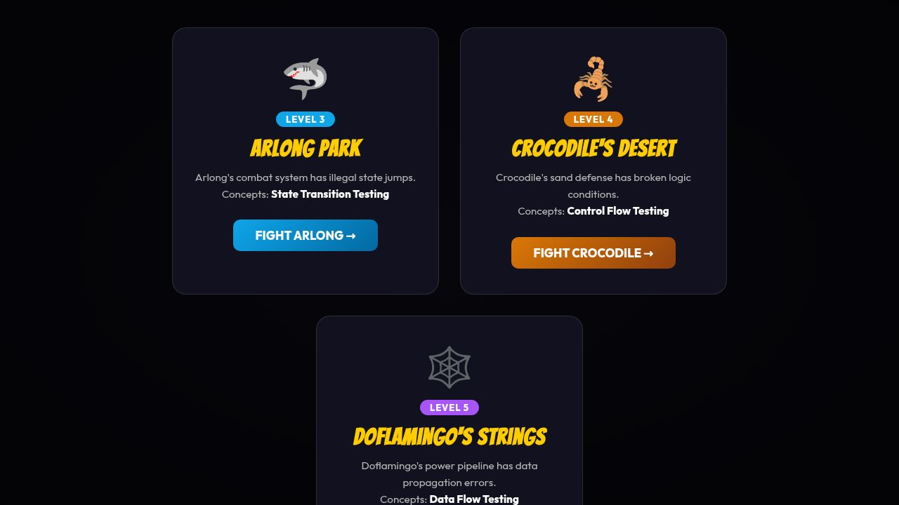

# Week 7 — QA Arcade: Boss Battles
### Vibe Coding Assignment — State Transition, Control Flow & Data Flow Testing

---

## Introduction

This assignment covers three advanced white-box testing methodologies: **State Transition Testing**, **Control Flow Testing**, and **Data Flow Testing**. Each technique targets a different dimension of how software behaves internally — how it moves through states, how it branches through logic, and how it transforms data as it flows through a pipeline.

### State Transition Testing
State Transition Testing maps all the valid states a system can be in and the legal transitions between them. A tester systematically exercises every transition — both valid (sunny day) and invalid (rainy day) — to confirm the system does not allow illegal state changes.

**When to use it:** Systems with clearly defined lifecycle states such as order workflows, user sessions, authentication flows, or game combat engines.

**Limitations:** The state space can grow exponentially as the number of states and events increases (state explosion problem). It can also miss bugs that depend on timing or concurrency between states.

---

### Control Flow Testing
Control Flow Testing verifies that every logical branch in a program's code is exercised. It is derived from the program's control flow graph — each `if/else`, `AND`, and `OR` condition represents a branch that must be tested with inputs that cause it to evaluate both `true` and `false`.

**When to use it:** Any system with complex conditional logic — security checks, eligibility rules, pricing engines, or permission systems.

**Limitations:** Full path coverage (testing every possible combination of branches) is often impractical. Branch coverage is the realistic goal. It also does not validate that the logic itself is correctly specified — only that each branch is reachable.

---

### Data Flow Testing
Data Flow Testing tracks how variables are defined, used, and transformed as they move through a processing pipeline. A bug is identified when a variable is defined incorrectly, applied out of order, or carries a wrong value into a subsequent step.

**When to use it:** Calculation pipelines, formula engines, financial computations, or any system where values are sequentially transformed through multiple steps.

**Limitations:** Data flow testing can be difficult to automate and requires understanding of the internal variable lifecycle. It may not catch bugs that only manifest under specific runtime conditions.

---

## Vibe Coding Assignment

The app is called **QA Arcade: Boss Battles** — a gamified React web application with a One Piece theme. Each of the three levels teaches one testing methodology by hiding intentional bugs inside a "Buggy Implementation" that deviates from a published "Specification." The player must find all the bugs within a limited number of attempts.

**Live App:** [QA Arcade — Boss Battles](https://mounikagarikipati.github.io/Software-Quality-Test/vibe%20coding%20assignments/week%207/)

**Tech Stack:** React 18, Vite 5, CSS animations

### Main Menu



The main menu displays all three boss battles — Arlong Park (Level 3), Crocodile's Desert (Level 4), and Doflamingo's Strings (Level 5).

---

### Level 3 — Arlong Park: State Transition Testing

The player is shown the valid state machine specification for Arlong's combat system:

| From | To (Valid) |
|------|-----------|
| Calm | Attacking |
| Attacking | Retreating, Defeated |
| Retreating | Attacking, Calm |
| Defeated | *(terminal — no exits)* |

The buggy implementation introduces 3 illegal transitions that deviate from the spec. The player selects a FROM state and a TO state, then clicks "Test Transition" to compare Expected vs Actual.

**Code snippet — valid spec vs buggy implementation:**

```js
// Specification (correct)
const VALID_TRANSITIONS = {
  'Calm':       ['Attacking'],
  'Attacking':  ['Retreating', 'Defeated'],
  'Retreating': ['Attacking', 'Calm'],
  'Defeated':   []
};

// Buggy implementation (intentional bugs)
function isActualValid_buggy(from, to) {
  if (from === 'Calm'      && to === 'Defeated')  return true;  // BUG 1
  if (from === 'Retreating'&& to === 'Attacking')  return false; // BUG 2
  if (from === 'Defeated'  && to === 'Attacking')  return true;  // BUG 3
  return isExpectedValid(from, to);
}
```

**Sunny Day Scenarios (no bug):**
- Calm → Attacking: Both spec and system say VALID ✔
- Attacking → Defeated: Both spec and system say VALID ✔

**Rainy Day Scenarios (bugs found):**
- Calm → Defeated: Spec says INVALID, system says VALID 🚨
- Retreating → Attacking: Spec says VALID, system says INVALID 🚨
- Defeated → Attacking: Spec says INVALID, system says VALID 🚨

---

### Level 4 — Crocodile's Desert: Control Flow Testing

The player tests a defense system that takes three boolean-style inputs: **Rain** (Yes/No), **Haki** (Yes/No), and **Strength** (Weak/Strong). The specification defines the expected defense level:

| Rain | Haki | Strength | Expected Defense |
|------|------|----------|-----------------|
| Yes  | Any  | Any      | OFF             |
| No   | Yes  | Any      | OFF             |
| No   | No   | Weak     | FULL            |
| No   | No   | Strong   | PARTIAL         |

The buggy implementation adds incorrect `AND` conditions, making the defense fail to turn OFF when it should.

**Code snippet — spec vs buggy:**

```js
// Specification
function getExpectedDefense(rain, haki, strength) {
  if (rain === 'Yes')   return 'OFF';
  if (haki === 'Yes')   return 'OFF';
  if (strength === 'Weak') return 'FULL';
  return 'PARTIAL';
}

// Buggy implementation
function getActualDefense_buggy(rain, haki, strength) {
  if (rain === 'Yes' && strength === 'Weak')    return 'OFF'; // BUG: extra AND
  if (haki === 'Yes' && strength === 'Strong')  return 'OFF'; // BUG: extra AND
  if (strength === 'Weak') return 'FULL';
  return 'PARTIAL';
}
```

**Sunny Day Scenarios (no bug):**
- Rain=No, Haki=No, Strength=Weak → Both: FULL ✔
- Rain=No, Haki=No, Strength=Strong → Both: PARTIAL ✔

**Rainy Day Scenarios (bugs found):**
- Rain=Yes, Haki=No, Strength=Strong → Spec: OFF, System: PARTIAL 🚨
- Rain=No, Haki=Yes, Strength=Weak → Spec: OFF, System: FULL 🚨

---

### Level 5 — Doflamingo's Strings: Data Flow Testing

The player tests a four-step power calculation pipeline. Variables are defined and passed from one step to the next. The buggy implementation changes the order of operations and uses a wrong multiplier for the Injured state.

**Specification pipeline:**
1. Base Power = 100
2. × Emotion multiplier (Calm×1.0, Angry×2.0, Injured×0.5)
3. If Awakened: + 50
4. − Distance × 3

**Code snippet — spec vs buggy:**

```js
// Specification
function getExpectedPower(emotion, awakened, distance) {
  let p = 100;
  p = p * EMOTION_MULT[emotion];      // Step 2 first
  if (awakened === 'Yes') p += 50;    // Step 3
  p -= distance * 3;                  // Step 4
  return Math.round(p);
}

// Buggy implementation — two data flow errors
const EMOTION_MULT_BUGGY = { Calm: 1.0, Angry: 2.0, Injured: 0.75 }; // Bug: 0.75 not 0.5

function getActualPower_buggy(emotion, awakened, distance) {
  let p = 100;
  if (awakened === 'Yes') p += 50;            // Bug: Step 3 applied BEFORE Step 2
  p = p * EMOTION_MULT_BUGGY[emotion];        // Wrong multiplier + wrong order
  p -= distance * 5;                          // Bug: multiplier 5 not 3
  return Math.round(p);
}
```

**Sunny Day Scenarios (no bug):**
- Calm, Not Awakened, 1m → Both: 97 ✔

**Rainy Day Scenarios (bugs found):**
- Angry, Awakened, 1m → Spec: 295, System: 295... varies with Injured/distance combos
- Injured, Awakened, any distance → Spec differs from System due to wrong multiplier (0.5 vs 0.75) and wrong order 🚨
- Any Emotion, any distance with distance multiplier mismatch (×3 vs ×5) 🚨

---

## Conclusion

### Problems Encountered

The biggest challenge was designing bugs that were realistic yet discoverable within the limited attempt count. Early versions of the Doflamingo pipeline had too many overlapping bugs that made it difficult for a tester to isolate which variable was wrong. Balancing difficulty required several iterations.

Another challenge was the React state management — the game had to distinguish between "already tested" and "bug found" combinations without allowing the player to re-trigger a bug count on the same input.

### What I Learned About AI Tools

The AI (Vibe coding with a large language model) was extremely effective at scaffolding the React component structure, CSS animations, and the game loop logic. It generated the initial state machine, control flow, and data flow functions quickly and with minimal errors.

However, the AI required very explicit prompting to introduce intentional bugs correctly — it had a tendency to write correct implementations. The bugs had to be described precisely (e.g., "swap steps 2 and 3 in the pipeline" and "change 0.5 to 0.75") rather than letting the AI decide what to break, because it defaulted to correctness.

The AI also excelled at writing the UI feedback system (comparing expected vs actual outputs and flagging mismatches), which would have been tedious to code by hand. Overall, AI tools significantly accelerated development but required careful human oversight to ensure the intentional defects were correctly embedded and the specifications were accurately represented.
